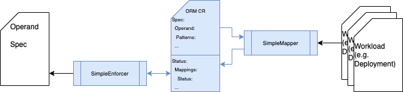

# Operator Resource Mapping
[](https://godoc.org/github.com/turbonomic/orm)
[](http://www.apache.org/licenses/LICENSE-2.0.html)

<<<<<<< HEAD
<em>Previous ORM CRD and Samples are moved to [archive](./archive/), please find doc for compatibility [here](./docs/compatibility.md).<em>


<!-- START doctoc generated TOC please keep comment here to allow auto update -->
<!-- DON'T EDIT THIS SECTION, INSTEAD RE-RUN doctoc TO UPDATE -->
**Table of Contents**  *generated with [DocToc](https://github.com/thlorenz/doctoc)*

- [Operator Resource Mapping](#operator-resource-mapping)
  - [Overview](#overview)
  - [QuickStart](#quickstart)
  - [Architecture](#architecture)
    - [Simple Implementation](#simple-implementation)
    - [Extensions](#extensions)

<!-- END doctoc generated TOC please keep comment here to allow auto update -->

## Overview

Operator Resource Mapping (ORM) is a mechanism to allow assets like [Kubeturbo](https://github.com/turbonomic/kubeturbo/wiki) to manage resources in an Operator managed Kubernetes cluster, for example to [vertically scale containers](https://github.com/turbonomic/kubeturbo/wiki/Action-Details#resizing-vertical-scaling-of-containerized-workloads) or [horizontally scale pods](https://github.com/turbonomic/kubeturbo/wiki/Action-Details#slo-horizontal-scaling-private-preview).

ORM works at operand basis, user defines which operand holds the desired status of which resources (source) and automatically coordinate resource changes.

## QuickStart

ORM leverages operator sdk to create/build project, follow the standard operator sdk approach to run it locally or generate images to deploy to a target cluster with right RBAC settings. 

Here are the instructions to run it locally outside cluster with our testing resources. 

Step 0. Prerequisite - ensure you have CLI access your target kubernetes cluster

Step 1. Clone the repository

```script
mkdir turbonomic
cd turbonomic
git clone https://github.com/turbonomic/orm.git
```

Step 2. Install CRD

```script
cd orm
kubectl apply -f ./config/crd/bases/devops.turbonomic.io_operatorresourcemappings.yaml
=======
Here’re the steps to deploy it:
1. Create the ORM Customer Resource Definition (CRD) in the kubernetes cluster (where kubeturbo is also running):
```bash
kubectl apply -f https://raw.githubusercontent.com/turbonomic/orm/master/config/crd/bases/turbo_operator_resource_mapping_crd_v1.yaml
```
>This CRD supports kubnernetes 1.16 and higher.
2. Next deploy the ORM Custom Resource (CR) for your application in the namespace of that app. Sample CRs are located [here](https://github.com/turbonomic/orm/tree/master/config/samples). In our example, to allow for resizing of Turbonomic Server app services, we will deploy the Turbonomic XL ORM CR into the namespace where the Turbonomic Server is running:
>>>>>>> upstream/master
```

Step 3. Start Controller with your outstanding access to kubernetes cluster

```script
% make run

test -s /Users/kuan/Workspace/src/github.com/kuanf/orm/bin/controller-gen || GOBIN=/Users/kuan/Workspace/src/github.com/kuanf/orm/bin go install sigs.k8s.io/controller-tools/cmd/controller-gen@v0.10.0
/Users/kuan/Workspace/src/github.com/kuanf/orm/bin/controller-gen rbac:roleName=manager-role crd webhook paths="./..." output:crd:artifacts:config=config/crd/bases
/Users/kuan/Workspace/src/github.com/kuanf/orm/bin/controller-gen object:headerFile="hack/boilerplate.go.txt" paths="./..."
go fmt ./...
go vet ./...
go run ./main.go
1.6680114457816792e+09  INFO    controller-runtime.metrics    Metrics server is starting to listen    {"addr": ":8080"}
1.668011446468928e+09   INFO    setup   starting manager
1.6680114464695108e+09  INFO    Starting server {"path": "/metrics", "kind": "metrics", "addr": "[::]:8080"}
1.6680114464695098e+09  INFO    Starting server {"kind": "health probe", "addr": "[::]:8081"}
1.668011446469908e+09   INFO    Starting EventSource {"controller": "operatorresourcemapping", "controllerGroup": "devops.turbonomic.io", "controllerKind": "OperatorResourceMapping", "source": "kind source: *v1alpha1.OperatorResourceMapping"}
1.66801144647004e+09    INFO    Starting Controller  {"controller": "operatorresourcemapping", "controllerGroup": "devops.turbonomic.io", "controllerKind": "OperatorResourceMapping"}
1.668011446671689e+09   INFO    Starting workers     {"controller": "operatorresourcemapping", "controllerGroup": "devops.turbonomic.io", "controllerKind": "OperatorResourceMapping", "worker count": 1}
1

...
```
<<<<<<< HEAD

Step 4 Try our `solo` test resources 

Previous console is occupied by controller running in foreground. You need another one for the commands in this step.

The `solo` test case intends to work without any operator. It makes a deployment (ormoperand) follows the changes in `replicas` and container `resources` from another deployment (ormsource). It consists of 3 resources as follow:

```scripts
kubectl apply -f ./test/solo/.

deployment.apps/ormoperand created
operatorresourcemapping.devops.turbonomic.io/solo created
deployment.apps/ormsource created
=======
3. Rediscover Kubeturbo target from Turbonomic UI and NO need to restart the corresponding Kubeturbo pod in cluster. ORM CR will be successfully discovered when you see a log message from Kubeturbo like this:
>>>>>>> upstream/master
```

After the resources are applied, you'll find the orm status already updated with values from ormsource deployment. 

```yaml
status:
  mappings:
  - mapped: ""
    operandPath: .spec.template.spec.containers[?(@.name=="nginx")].resources
    value:
      resources:
        limits:
          cpu: 200m
          memory: 900Mi
        requests:
          cpu: 50m
          memory: 200Mi
  - mapped: ""
    operandPath: .spec.replicas
    value:
      replicas: 3
  type: ok

```

When you change the ormsource deployment, the status in orm CR follows.

At this point of time, the enforcement mode in orm is set to `none`, so nothing happens to the ormoperand deployment. But after you change the mode to `once`, everytime you change the pod replicas and/or container resources in ormsource, the ormoperand follows.

```yaml
apiVersion: devops.turbonomic.io/v1alpha1
kind: OperatorResourceMapping
metadata:
  name: solo
  namespace: default
...
spec:
  enforcement: none # none/once
  operand:
    apiVersion: apps/v1
    kind: Deployment
    name: ormoperand
...
```


## Architecture

ORM introduces Custom Resource Definition (CRD) for users to define target operand, patterns and report status of the mapping (to be) done by orm. There are two types of the controllers working with ORM Custom Resources(CR)s: Enforcer and Mapper.



Mapper reads the Patters defined in ORM CR spec, translate it to actual mapping and monitor the target resource to update the value dynamically into ORM CR status.

Enforcer read the mapping in ORM CR status and enforce it to the operand defined in ORM CR spec. There various mode to enforce the change: none, once, always. 

- none: orm is for advisory only, no changes will be applied to operand
- once: orm apply the change only once when the mapping is created/updated, after that operand could be changed by others
- always: orm monitor the operand resource defined in ORM CR and ensure the target fields are updated as indicated in ORM

### Simple Implementation

A simple implementation of mapper and enforcer is provided for users to develop and test their ORMs. In this simple implementation, 

- simple-mapper watches the actual resource managed by the operand and use the changes outside operator controller (via managedFields) to 
fill the ORM CR
- simple-enforcer update the operand from ORM CR status

### Extensions

Mapper and Enforcer could be extended for complex or simply production use cases. Mapper could talk with 3rd party "brain" to decide what to be changed; wihle Enforcer could be repurposed to chase the source of trueth and take actions other than updating a resource in kubernetes.

## Next Step

Now you understand the architecture of ORM and tried our test resources, go ahead create your own ORM for your operators