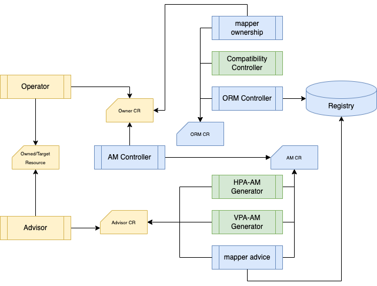

# Operator Resource Mapping
[](https://godoc.org/github.com/turbonomic/orm)
[](http://www.apache.org/licenses/LICENSE-2.0.html)


<em>Previous ORM CRD and Samples are moved to [archive](./archive/), please find doc for compatibility [here](./docs/compatibility.md).</em>


<!-- START doctoc generated TOC please keep comment here to allow auto update -->
<!-- DON'T EDIT THIS SECTION, INSTEAD RE-RUN doctoc TO UPDATE -->
**Table of Contents**  *generated with [DocToc](https://github.com/thlorenz/doctoc)*

- [Overview](#overview)
  - [Terminology](#terminology)
- [QuickStart](#quickstart)
  - [Step 0. Prerequisite - ensure you have CLI access your target kubernetes cluster](#step-0-prerequisite---ensure-you-have-cli-access-your-target-kubernetes-cluster)
  - [Step 1. Clone the repository](#step-1-clone-the-repository)
  - [Step 2. Install CRD](#step-2-install-crd)
  - [Step 3. Start Controller with your outstanding access to kubernetes cluster](#step-3-start-controller-with-your-outstanding-access-to-kubernetes-cluster)
  - [Step 4 Try our `solo` test resources](#step-4-try-our-solo-test-resources)
  - [Step 5 Try Patterns with selectors and parameters](#step-5-try-patterns-with-selectors-and-parameters)
- [Architecture](#architecture)
  - [Core Controllers](#core-controllers)
  - [Utility Controllers](#utility-controllers)
- [Next Step](#next-step)

<!-- END doctoc generated TOC please keep comment here to allow auto update -->

## Overview

Operator Resource Mapping (ORM) is a map to allow assets like [Kubeturbo](https://github.com/turbonomic/kubeturbo/wiki) to manage resources in an Operator managed Kubernetes cluster, for example to [vertically scale containers](https://github.com/turbonomic/kubeturbo/wiki/Action-Details#resizing-vertical-scaling-of-containerized-workloads) or [horizontally scale pods](https://github.com/turbonomic/kubeturbo/wiki/Action-Details#slo-horizontal-scaling-private-preview).

ORM works at operand basis, user defines which operand holds the desired status of which resources so that other assets can coordinate resource changes. 

This repo provides new ORM resource scheme, legacy ORM CRD and examples are in archive folder. Controllers in this repo are 

- helping users to compose and test ORMs with the operands and deployed resources only.
- generating ORM resource from legacy ORM resources for backward compatibility

### Terminology

`Owner`: the operator resource who owns actual deployed resources. Changes in `owner` trigger operator to update deployed/`owned` resources

`Owned` resource: resources deployed by operator, answer to changes in operand/`owner`

`Mapping`: pair of paths in `owner` and `owned` resources

`Pattern`: pair of paths in `owner` and `owned` resource. Parameters can be defined in `patters` in order to generate multiple `mapping` from one `pattern`.

`Selectors`: predefined label selectors to be reused in patterns

`Parameters`: predefined list of strings for mapping generation

Predefined Parameters - all predefined parameters starts with "."

 - `.owned.name`: refer to the name of the owned resource. Together with label selector of `owned` resource, a pattern can generate lots of mappings if the naming is right.

## QuickStart

ORM leverages operator sdk to create/build project, follow the standard operator sdk approach to run it locally or generate images to deploy to a target cluster with right RBAC settings. 

Here are the instructions to run it locally outside cluster with our testing resources. 

### Step 0. Prerequisite - ensure you have CLI access your target kubernetes cluster

### Step 1. Clone the repository

```script
mkdir turbonomic
cd turbonomic
git clone https://github.com/turbonomic/orm.git
```

### Step 2. Install CRD

```script
cd orm
% kubectl apply -f ./config/crd/bases 
customresourcedefinition.apiextensions.k8s.io/operatorresourcemappings.devops.turbonomic.io created
customresourcedefinition.apiextensions.k8s.io/operatorresourcemappings.turbonomic.com created
```

note: old orm crd is also created for backward compatibility controller

### Step 3. Start Controller with your outstanding access to kubernetes cluster

```script
%make run
...
1.676652505232917e+09   INFO    controller-runtime.metrics      Metrics server is starting to listen    {"addr": ":8080"}
1.676652506578926e+09   INFO    setup   starting manager
1.676652506579638e+09   INFO    Starting server {"path": "/metrics", "kind": "metrics", "addr": "[::]:8080"}
1.676652506579651e+09   INFO    Starting server {"kind": "health probe", "addr": "[::]:8081"}
1.67665250658025e+09    INFO    Starting EventSource    {"controller": "operatorresourcemapping", "controllerGroup": "turbonomic.com", "controllerKind": "OperatorResourceMapping", "source": "kind source: *unstructured.Unstructured"}
1.676652506580307e+09   INFO    Starting Controller     {"controller": "operatorresourcemapping", "controllerGroup": "turbonomic.com", "controllerKind": "OperatorResourceMapping"}
1.6766525065802581e+09  INFO    Starting EventSource    {"controller": "operatorresourcemapping", "controllerGroup": "devops.turbonomic.io", "controllerKind": "OperatorResourceMapping", "source": "kind source: *v1alpha1.OperatorResourceMapping"}
1.6766525065803242e+09  INFO    Starting Controller     {"controller": "operatorresourcemapping", "controllerGroup": "devops.turbonomic.io", "controllerKind": "OperatorResourceMapping"}
1.676652506782094e+09   INFO    Starting workers        {"controller": "operatorresourcemapping", "controllerGroup": "devops.turbonomic.io", "controllerKind": "OperatorResourceMapping", "worker count": 1}
1.6766525067822971e+09  INFO    Starting workers        {"controller": "operatorresourcemapping", "controllerGroup": "turbonomic.com", "controllerKind": "OperatorResourceMapping", "worker count": 1}
...
```

### Step 4 Try our `solo` test resources 

Previous console is occupied by controller running in foreground. You need another one for the commands in this step. Make sure the 2nd console also access the same kubernetes cluster as the first one.

The `solo` test case creates mapping from one deployment to another. It consists of 3 resources as follow:

```scripts
kubectl apply -f ./test/solo/.

deployment.apps/ormoperand created
operatorresourcemapping.devops.turbonomic.io/solo created
deployment.apps/ormsource created
```

After the resources are applied, you'll find the orm status already updated with values from ormoperand deployment. 

```yaml
  status:
    owner:
      apiVersion: apps/v1
      kind: Deployment
      name: ormowner-solo
      namespace: default
    ownerValues:
    - owned:
        apiVersion: apps/v1
        kind: Deployment
        name: ormowned-solo
        namespace: default
        path: .spec.replicas
      ownerPath: .spec.replicas
      value:
        replicas: 3
    - owned:
        apiVersion: apps/v1
        kind: Deployment
        name: ormowned-solo
        namespace: default
        path: .spec.template.spec.containers[?(@.name=="workload-0001")].resources
      ownerPath: .spec.template.spec.containers[?(@.name=="workload-0001")].resources
      value:
        resources:
          limits:
            cpu: 100m
            memory: 100Mi
          requests:
            cpu: 50m
            memory: 50Mi
    state: ok
```

If there are errors in your ORM, or you modify the paths defined in your ORM, you can see message in ORM status helping you to fix the problem. Here are some example messages after we corrupt the paths


```yaml
    - message: Failed to locate ownerPath in owner
      ownerPath: .spec.template.spec.containers[?(@.name=="workload-001")].resources
      reason: OwnerError
```

```yaml
    - message: Failed to locate mapping path .spec.template.spec.containers[?(@.name=="workload-OOO1")].resources
        in owned resource
      ownerPath: .spec.template.spec.containers[?(@.name=="workload-0001")].resources
      reason: OwnedResourceError
```

### Step 5 Try Patterns with selectors and parameters

Continue in the 2nd console.

The `pattern` test case intends to show how to use selectors, (predefined) parameters in patterns.  It uses predefined selector `core`, predefined parameter `.owned.name` and parameter `ports` to generate 4 mappings from 1 pattern definition in spec.

```yaml
  status:
    owner:
      apiVersion: apps/v1
      kind: Deployment
      name: ormoperand-patterns
      namespace: default
    ownerValues:
    - owned:
        apiVersion: apps/v1
        kind: Deployment
        name: ormsource-patterns-0001
        namespace: default
        path: .spec.template.spec.containers[?(@.name=="ormsource-patterns-0001")].ports[?(@.protocol=="TCP")].containerPort
      ownerPath: .spec.template.spec.containers[?(@.name=="ormsource-patterns-0001")].ports[?(@.protocol=="TCP")].containerPort
      value:
        containerPort: 81
    - owned:
        apiVersion: apps/v1
        kind: Deployment
        name: ormsource-patterns-0001
        namespace: default
        path: .spec.template.spec.containers[?(@.name=="ormsource-patterns-0001")].ports[?(@.protocol=="UDP")].containerPort
      ownerPath: .spec.template.spec.containers[?(@.name=="ormsource-patterns-0001")].ports[?(@.protocol=="UDP")].containerPort
      value:
        containerPort: 10001
    - owned:
        apiVersion: apps/v1
        kind: Deployment
        name: ormsource-patterns-0002
        namespace: default
        path: .spec.template.spec.containers[?(@.name=="ormsource-patterns-0002")].ports[?(@.protocol=="TCP")].containerPort
      ownerPath: .spec.template.spec.containers[?(@.name=="ormsource-patterns-0002")].ports[?(@.protocol=="TCP")].containerPort
      value:
        containerPort: 82
    - owned:
        apiVersion: apps/v1
        kind: Deployment
        name: ormsource-patterns-0002
        namespace: default
        path: .spec.template.spec.containers[?(@.name=="ormsource-patterns-0002")].ports[?(@.protocol=="UDP")].containerPort
      ownerPath: .spec.template.spec.containers[?(@.name=="ormsource-patterns-0002")].ports[?(@.protocol=="UDP")].containerPort
      value:
        containerPort: 10002
    state: ok
```

The identifier of the owned resource(s) are defined by one and only one of the following:
name, selector, labelSelector. An error will be reported if there are more than one.

```yaml
  status:
    owner: {}
    ownerValues:
    - message: allow 1 and only 1 input from owned.name, owned.selector, owner.labelSelector
      owned:
        apiVersion: apps/v1
        kind: Deployment
        name: ormsource-patterns-0002
        path: .spec.template.spec.containers[?(@.name=="{{.owned.name}}")].ports[?(@.protocol=="{{ports}}")].containerPort
        selector: core
      ownerPath: .spec.template.spec.containers[?(@.name=="{{.owned.name}}")].ports[?(@.protocol=="{{ports}}")].containerPort
      reason: OwnedResourceError
    state: error
```

## Architecture

System architecture is described in the figure below:



### Core Controllers

ORM Controller – watch ORM resource and update registry with mappings

AM Controller – watch AM resource and update the owner

Mapper Advice – retrieve value from advice resource and update AM status with actual owner

Mapper Ownership – retrieve value from owner resource and update ORM status

### Utility Controllers

Compatibility Controller - Generate new ORM from legacy ORM

HPA-AM Generator - Generate AM from HPA

VPA-AM Generator - Generate AM from VPA

## Next Step

Now you understand the architecture of ORM and tried our test resources, go ahead create your own ORM for your operators