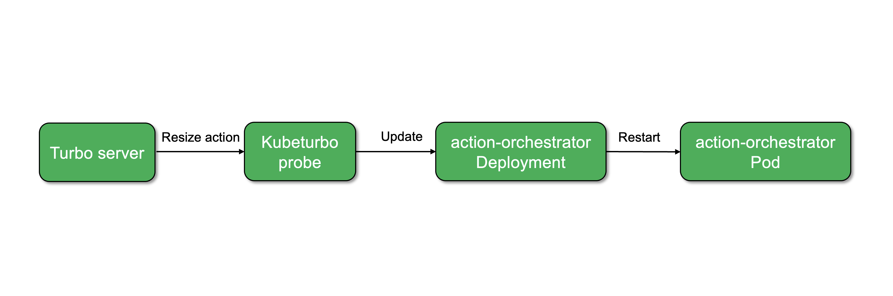
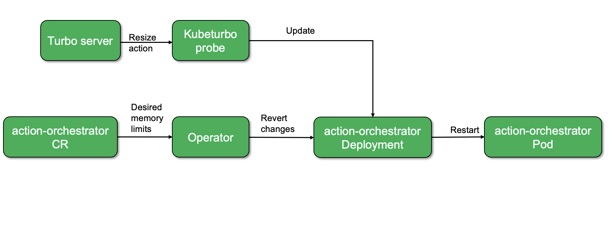
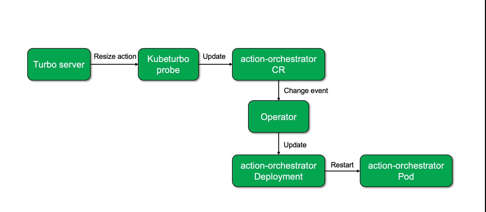
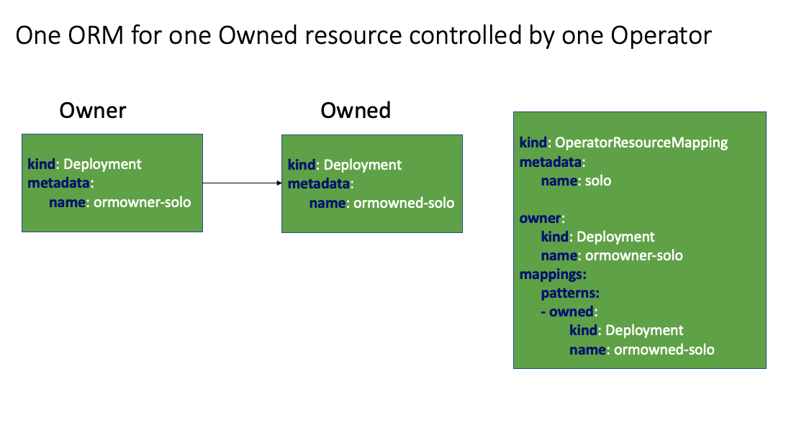
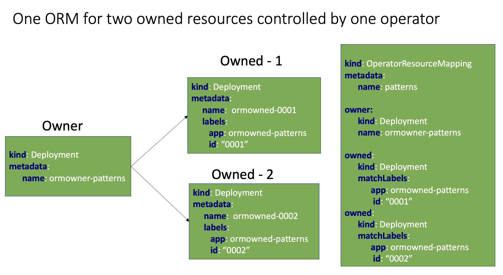
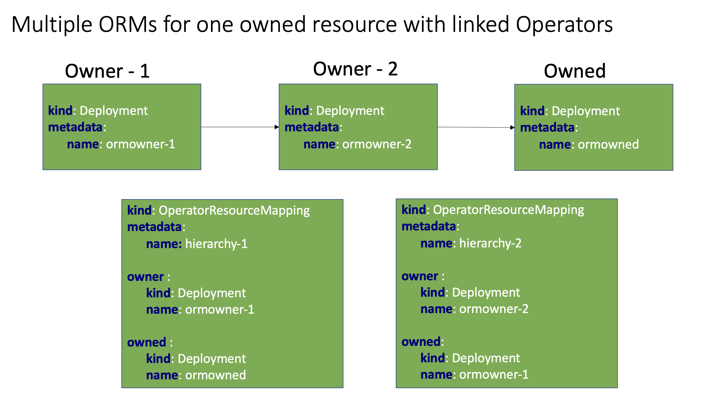
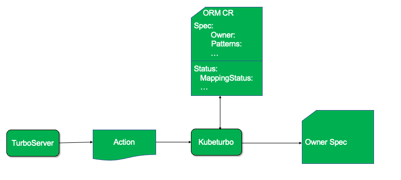

# Operator Resource Mapping
[](https://godoc.org/github.com/turbonomic/orm)
[](http://www.apache.org/licenses/LICENSE-2.0.html)
[](https://goreportcard.com/report/github.com/turbonomic/orm)

<em>Previous ORM CRD and Samples are moved to [archive](./archive/), please find doc for compatibility [here](./docs/compatibility.md).</em>


<!-- START doctoc generated TOC please keep comment here to allow auto update -->
<!-- DON'T EDIT THIS SECTION, INSTEAD RE-RUN doctoc TO UPDATE -->
**Table of Contents**  *generated with [DocToc](https://github.com/thlorenz/doctoc)*

- [Overview](#overview)
  - [Terminology](#terminology)
- [ORM Schema](#orm-schema)
- [Use Cases](#use-cases)
- [QuickStart to Test Your ORM CR with Turbonomic/Kubeturbo](#quickstart-to-test-your-orm-cr-with-turbonomickubeturbo)
    - [Architecture](#architecture)
    - [Step 1. Clone the repository](#step-1-clone-the-repository)
    - [Step 2. Deploy ORM](#step-2-deploy-orm)
    - [Step 3 Try Redis example](#step-3-try-redis-example)
      - [Prepare Standalone Redis](#prepare-standalone-redis)
      - [Apply OperatorResourceMapping for Redis](#apply-operatorresourcemapping-for-redis)

<!-- END doctoc generated TOC please keep comment here to allow auto update -->

## Overview

Operator Resource Mapping (ORM) is designed to map identifying exactly how to update a Custom Resource so that assets like [Kubeturbo](https://github.com/turbonomic/kubeturbo/wiki) can programmatically update workload specifications that are controlled by an Operator, for example to [vertically scale containers](https://github.com/turbonomic/kubeturbo/wiki/Action-Details#resizing-vertical-scaling-of-containerized-workloads) by updating container specs or [horizontally scale pods](https://github.com/turbonomic/kubeturbo/wiki/Action-Details#slo-horizontal-scaling-private-preview) by managing the number of replicas.

In this setup, an Operator oversees the lifecycle of microservice-based applications using a declarative approach to maintain their intended state (e.g., Pod replicas, memory limits, etc.). However, any direct interventions by Turbo to alter the size of workload controllers such as StatefulSet, DaemonSet, Deployment, either vertically or horizontally, will be reverted by the Operator.

To better understand this, let's examine two different scenarios involving container resizing actions in Kubeturbo, with and without an Operator.

### Container Resize without Operator



Here, updates made to the deployment will persist successfully.

### Container Resize with Operator



In this scenario, the Operator will reverse any updates made to the Deployment, because the changes were not handled through the Operator's CR(Custom Resource).

### Solution

### Manage Changes through the Operator's Custom Resource

The proposed solution involves updating workload specifications via the CR allowing the operator to roll out the changes. But in order for any component, such as the Kubeturbo probe, to make changes to the CR, there must be a guide or a map provided that directs how changes can be made.



ORM works at an operand basis. The user will define within the ORM which operand provides the desired status of which resources that can be managed. The user will provide information on the parameters that directs how other assets can programmatically make changes to the Custom Resource.

This repo provides new ORM resource scheme, legacy ORM CRD and examples are in [archive folder](https://github.com/turbonomic/orm/tree/master/archive).

### Terminology

`Advisor`: Tools providing recommendations to workloads (e.g. Turbonomic, HorizontalPodAutoscaler, VerticalPodAutoScaler). In this phase 1, Advisor can get the mapping from ORM resource and modify the owner for recommendation.

`Owner`: the operator resource who owns actual deployed resources. Changes in `owner` trigger operator to update deployed/`owned` resources

`Owned` resource: resources deployed by operator, answer to changes in operand/`owner`

`Mapping`: pair of paths in `owner` and `owned` resources

`Pattern`: pair of paths in `owner` and `owned` resource. Parameters can be defined in `patters` in order to generate multiple `mapping` from one `pattern`.

`Selectors`: predefined label selectors to be reused in patterns

`Parameters`: predefined list of strings for mapping generation

Predefined Parameters - all predefined parameters starts with "."

 - `.owned.name`: refer to the name of the owned resource. Together with label selector of `owned` resource, a pattern can generate lots of mappings if the naming is right.

## ORM Schema

```yaml
apiVersion: devops.turbonomic.io/v1alpha1 # version of the api that manifest is using
kind: OperatorResourceMapping # type of kubernetes resource
metadata:
  name: orm # name of the resource
  namespace: # namespace where this resource is located
...
spec:
  mappings:
    patterns:
      - owned:
          apiVersion: # api version for owned resource
          kind: # type of owned resource
          path: # The JSON path to the resource property to be mapped, targeting specific containers within an owned resource.
          selector: # reference to the selector
        ownerPath: #JSON path to the resource location in the owner object, where the values should be reflected
    selectors: # Defines label selectors for identifying resources.
      xyz: # A named selector.
        matchLabels: # Label selectors used to identify resources
         ...
  owner:
    apiVersion: # The API version of the owner resource
    kind: # The kind of the owner resource
    name: # The name of the owner resource
status:
  lastTransitionTime: # The timestamp of the last status change
  owner:
    apiVersion: # Details of owner resource specified in 'spec.owner'
    kind:
    name:
    namespace:
  ownerValues: # The values from the owner resource that correspond to the mappings.
    - owned: # Details of the owned resource specified in 'spec.mappings.patterns.owned'
        apiVersion:
        kind:
        name:
        namespace:
        path: # The JSON path to the resource property to be mapped, targeting specific containers within an owned resource.
      ownerPath: #JSON path to the resource location in the owner object, where the values should be reflected
      value:
        resources: {}
  state: # The status of the resource mapping indicates whether it is 'ok' or if there have been any errors with a reason during the discovery of ORM's and building the ORM mapping registry .
```

Sample Operator resource mappings can be found [here](https://github.com/turbonomic/orm/tree/master/library)

## Use Cases

### One ORM for one Owned Resource controlled by one Operator



Example for this use case can be found [here](https://github.com/turbonomic/orm/tree/master/test/solo)

### One ORM for two Owned Resource controlled by one Operator



Example for this use case can be found [here](https://github.com/turbonomic/orm/tree/master/test/patterns)

### Multiple ORM's for one Owned Resource with Hierarchy of Operators



Example for this use case can be found [here](https://github.com/turbonomic/orm/tree/master/test/hierarchy)

## QuickStart to Test Your ORM CR with Turbonomic/Kubeturbo

### Architecture

System architecture for ORM CR with Turbonomic/Kubeturbo is described in the figure below:



### Step 1. Clone the repository

```script
mkdir turbonomic
cd turbonomic
git clone https://github.com/turbonomic/orm.git
cd orm
```

### Step 2. Deploy ORM

1. Create the ORM [Customer Resource Definition (CRD)](https://github.com/turbonomic/orm/tree/master/config/crd/bases) in the kubernetes cluster (where kubeturbo is also running):
```bash
kubectl apply -f config/crd/bases/devops.turbonomic.io_operatorresourcemappings.yaml
```
>This CRD supports kubnernetes 1.16 and higher.
2. Next deploy the ORM Custom Resource (CR) for your application in the namespace of that app. Sample CRs are located [here](https://github.com/turbonomic/orm/tree/master/library). In our example, to allow for resizing of Turbonomic Server app services, we will deploy the Turbonomic XL ORM CR into the namespace where the Turbonomic Server is running:
```bash
kubectl -n turbonomic apply -f library/ibm/turbo_operator_resource_mapping_sample_cr.yaml
```
3. Rediscover Kubeturbo target from Turbonomic UI and NO need to restart the corresponding Kubeturbo pod in cluster. ORM CR will be successfully discovered when you see a log message from Kubeturbo like this:
```
I0118 22:34:08.013144       1 k8s_discovery_client.go:327] Discovered 1 v2 ORM Resources.
```

### Note:

In order for Kubeturbo to access Operator managed CR's from CRD and map the resources using ORM, Kubeturbo should run with cluster-admin role. You can find more details about Kubeturbo Cluster roles [here](https://github.com/turbonomic/kubeturbo/wiki/Kubeturbo-Cluster-Roles)

### Step 3 Try Redis example

#### Prepare Standalone Redis

In order to show relationship between operator and the resource it manages we use Redis operator from [OT_CONTAINER-KIT](https://github.com/OT-CONTAINER-KIT/redis-operator#quickstart). We created redis standalone.

```shell
helm list -A
```

```
NAME            NAMESPACE       REVISION        UPDATED                                 STATUS          CHART                      APP VERSION
redis           ot-operators    1               2023-05-04 12:27:31.051399 -0400 EDT    deployed        redis-0.14.2           0.14.0     
redis-operator  ot-operators    1               2023-03-13 12:31:40.264923 -0400 EDT    deployed        redis-operator-0.14.3      0.14.0     
```
#### Redis Standalone Controller Resource

```shell
kubectl get statefulset -n ot-operators -oyaml
```

```yaml
apiVersion: v1
items:
- apiVersion: apps/v1
  kind: StatefulSet
  metadata:
    annotations:
      redis.opstreelabs.in: "true"
      redis.opstreelabs.instance: redis-standalone
    creationTimestamp: "2024-01-25T21:48:58Z"
    generation: 1
    labels:
      app: redis-standalone
      redis_setup_type: standalone
      role: standalone
    name: redis-standalone
    namespace: ot-operators
    ownerReferences:
    - apiVersion: redis.redis.opstreelabs.in/v1beta1
      controller: true
      kind: Redis
      name: redis-standalone
      uid: 6dd0759d-0c67-48e7-903b-bf74b9c8e4a1
    resourceVersion: "41508623"
    uid: 256b404c-1961-471e-9d1c-5085d44e2de2
  spec:
    podManagementPolicy: OrderedReady
    replicas: 1
    revisionHistoryLimit: 10
    selector:
      matchLabels:
        app: redis-standalone
        redis_setup_type: standalone
        role: standalone
    serviceName: redis-standalone-headless
    template:
      metadata:
        annotations:
          redis.opstreelabs.in: "true"
          redis.opstreelabs.instance: redis-standalone
        creationTimestamp: null
        labels:
          app: redis-standalone
          redis_setup_type: standalone
          role: standalone
      spec:
        containers:
        - env:
          - name: REDIS_ADDR
            value: redis://localhost:6379
          - name: SERVER_MODE
            value: standalone
          - name: SETUP_MODE
            value: standalone
          image: quay.io/opstree/redis:v7.0.5
          imagePullPolicy: IfNotPresent
          livenessProbe:
            exec:
              command:
              - bash
              - /usr/bin/healthcheck.sh
            failureThreshold: 3
            initialDelaySeconds: 1
            periodSeconds: 10
            successThreshold: 1
            timeoutSeconds: 1
          name: redis-standalone
          readinessProbe:
            exec:
              command:
              - bash
              - /usr/bin/healthcheck.sh
            failureThreshold: 3
            initialDelaySeconds: 1
            periodSeconds: 10
            successThreshold: 1
            timeoutSeconds: 1
          resources:
            limits:
              cpu: 100m
              memory: 128Mi
            requests:
              cpu: 20m
              memory: 24Mi
          terminationMessagePath: /dev/termination-log
          terminationMessagePolicy: File
        dnsPolicy: ClusterFirst
        restartPolicy: Always
        schedulerName: default-scheduler
        securityContext: {}
        terminationGracePeriodSeconds: 30
    updateStrategy:
      rollingUpdate:
        partition: 0
      type: RollingUpdate
  status:
    availableReplicas: 1
    collisionCount: 0
    currentReplicas: 1
    currentRevision: redis-standalone-799b86b4b5
    observedGeneration: 1
    readyReplicas: 1
    replicas: 1
    updateRevision: redis-standalone-799b86b4b5
    updatedReplicas: 1
kind: List
metadata:
  resourceVersion: ""

```

#### Redis Operator Custom Resource

```shell
kubectl get redis redis-standalone -n ot-operators -oyaml
```

```yaml
apiVersion: redis.redis.opstreelabs.in/v1beta1
kind: Redis
metadata:
  annotations:
    kubectl.kubernetes.io/last-applied-configuration:
  creationTimestamp: "2024-01-25T21:48:58Z"
  finalizers:
    - redisFinalizer
  generation: 2
  name: redis-standalone
  namespace: ot-operators
  resourceVersion: "41508397"
  uid: 6dd0759d-0c67-48e7-903b-bf74b9c8e4a1
spec:
  kubernetesConfig:
    image: quay.io/opstree/redis:v7.0.5
    imagePullPolicy: IfNotPresent
    resources:
      limits:
        cpu: 100m
        memory: 128Mi
      requests:
        cpu: 20m
        memory: 24Mi
  livenessProbe:
    failureThreshold: 3
    initialDelaySeconds: 1
    periodSeconds: 10
    successThreshold: 1
    timeoutSeconds: 1
  readinessProbe:
    failureThreshold: 3
    initialDelaySeconds: 1
    periodSeconds: 10
    successThreshold: 1
    timeoutSeconds: 1
  redisExporter:
    image: quay.io/opstree/redis-exporter:v1.44.0
  securityContext: {}


```
#### Apply OperatorResourceMapping for Redis

Apply the [redis standalone orm](https://github.com/turbonomic/orm/tree/master/library/redis) from library and you can see the pattern defined in `spec` are located in the cluster. Details are showed in `status`.

```shell
kubectl get orm -n ot-operators redis-orm -o yaml
```

```yaml
apiVersion: devops.turbonomic.io/v1alpha1
kind: OperatorResourceMapping
metadata:
  name: redis-orm
  namespace: ot-operators
...
spec:
  mappings:
    patterns:
    - owned:
        apiVersion: apps/v1
        kind: StatefulSet
        path: .spec.template.spec.containers[?(@.name=="redis")].resources
        selector: my_redis_sts
      ownerPath: .spec.kubernetesConfig.resources
    selectors:
      my_redis_sts:
        matchLabels:
          app: redis
  owner:
    apiVersion: redis.redis.opstreelabs.in/v1beta1
    kind: Redis
    name: redis
status:
  lastTransitionTime: "2023-05-04T17:27:05Z"
  owner:
    apiVersion: redis.redis.opstreelabs.in/v1beta1
    kind: Redis
    name: redis
    namespace: ot-operators
  ownerValues:
  - owned:
      apiVersion: apps/v1
      kind: StatefulSet
      name: redis
      namespace: ot-operators
      path: .spec.template.spec.containers[?(@.name=="redis")].resources
    ownerPath: .spec.kubernetesConfig.resources
    value:
      resources: {}
  state: ok
```