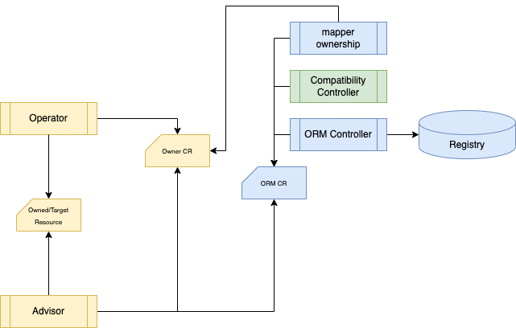

# Operator Resource Mapping
[](https://godoc.org/github.com/turbonomic/orm)
[](http://www.apache.org/licenses/LICENSE-2.0.html)
[](https://goreportcard.com/report/github.com/turbonomic/orm)


<em>Previous ORM CRD and Samples are moved to [archive](./archive/), please find doc for compatibility [here](./docs/compatibility.md).</em>


<!-- START doctoc generated TOC please keep comment here to allow auto update -->
<!-- DON'T EDIT THIS SECTION, INSTEAD RE-RUN doctoc TO UPDATE -->
**Table of Contents**  *generated with [DocToc](https://github.com/thlorenz/doctoc)*

- [Overview](#overview)
  - [Terminology](#terminology)
- [Architecture](#architecture)
  - [Core Controllers](#core-controllers)
  - [Utility Controllers](#utility-controllers)
- [QuickStart](#quickstart)
  - [Step 1. Clone the repository](#step-1-clone-the-repository)
  - [Step 2. Build and Run](#step-2-build-and-run)
    - [Run locally](#run-locally)
    - [Other options](#other-options)
  - [Step 3 Try Redis example](#step-3-try-redis-example)
    - [Prepare Standalone Redis](#prepare-standalone-redis)
    - [Apply OperatorResourceMapping for Redis](#apply-operatorresourcemapping-for-redis)
- [Next Step](#next-step)

<!-- END doctoc generated TOC please keep comment here to allow auto update -->

## Overview

Operator Resource Mapping (ORM) is a map to allow assets like [Kubeturbo](https://github.com/turbonomic/kubeturbo/wiki) to manage resources in an Operator managed Kubernetes cluster, for example to [vertically scale containers](https://github.com/turbonomic/kubeturbo/wiki/Action-Details#resizing-vertical-scaling-of-containerized-workloads) or [horizontally scale pods](https://github.com/turbonomic/kubeturbo/wiki/Action-Details#slo-horizontal-scaling-private-preview).

ORM works at operand basis, user defines which operand holds the desired status of which resources so that other assets can coordinate resource changes. 

This repo provides new ORM resource scheme, legacy ORM CRD and examples are in archive folder. Controllers in this repo are 

- helping users to compose and test ORMs with the operands and deployed resources only.
- generating ORM resource from legacy ORM resources for backward compatibility

### Terminology

`Advisor`: controllers provide recommendations to workloads (e.g. Turbonomic, HorizontalPodAutoscaler, VerticalPodAutoScaler)

`Owner`: the operator resource who owns actual deployed resources. Changes in `owner` trigger operator to update deployed/`owned` resources

`Owned` resource: resources deployed by operator, answer to changes in operand/`owner`

`Mapping`: pair of paths in `owner` and `owned` resources

`Pattern`: pair of paths in `owner` and `owned` resource. Parameters can be defined in `patters` in order to generate multiple `mapping` from one `pattern`.

`Selectors`: predefined label selectors to be reused in patterns

`Parameters`: predefined list of strings for mapping generation

Predefined Parameters - all predefined parameters starts with "."

 - `.owned.name`: refer to the name of the owned resource. Together with label selector of `owned` resource, a pattern can generate lots of mappings if the naming is right.

## Architecture

System architecture is described in the figure below:



### Core Controllers

ORM Controller – watch ORM resource and update registry with mappings

Mapper Ownership – retrieve value from owner resource and update ORM status

### Utility Controllers

Compatibility Controller - Generate new ORM from legacy ORM


## QuickStart

ORM leverages operator sdk to create/build project, follow the standard operator sdk approach to run it locally or generate images to deploy to a target cluster with right RBAC settings. 

### Step 1. Clone the repository

```script
mkdir turbonomic
cd turbonomic
git clone https://github.com/turbonomic/orm.git
cd orm
```

### Step 2. Build and Run

#### Run locally

You're able to run the orm controllers if you have access to a kubernetes cluster. Please ensure the rbac of your current access is able to cover the resources you want map.

```shell
make install run
```

You terminal is occupied by the controller after it is started, you need to start another terminal to try examples

#### Other options

Feel free to try other approaches in Operator SDK such as [OLM deployment](https://master.sdk.operatorframework.io/docs/building-operators/golang/quickstart/#olm-deployment), [Direct deployment](https://master.sdk.operatorframework.io/docs/building-operators/golang/quickstart/#direct-deployment).

### Step 3 Try Redis example

#### Prepare Standalone Redis

In order to show relationship between operator and the resource it manages we use Redis operator from [OT_CONTAINER-KIT](https://github.com/OT-CONTAINER-KIT/redis-operator#quickstart). We created redis standalone.

```shell
helm list -A
```

```
NAME            NAMESPACE       REVISION        UPDATED                                 STATUS          CHART                      APP VERSION
redis           ot-operators    1               2023-05-04 12:27:31.051399 -0400 EDT    deployed        redis-0.14.2           0.14.0     
redis-operator  ot-operators    1               2023-03-13 12:31:40.264923 -0400 EDT    deployed        redis-operator-0.14.3      0.14.0     
```

#### Apply OperatorResourceMapping for Redis

Apply the redis standalone orm from library and you can see the pattern defined in `spec` are located in the cluster. Details are showed in `status`.

```shell
kubectl get orm -n ot-operators redis-orm -o yaml
```

```yaml
apiVersion: devops.turbonomic.io/v1alpha1
kind: OperatorResourceMapping
metadata:
  name: redis-orm
  namespace: ot-operators
...
spec:
  mappings:
    patterns:
    - owned:
        apiVersion: apps/v1
        kind: StatefulSet
        path: .spec.template.spec.containers[?(@.name=="redis")].resources
        selector: my_redis_sts
      ownerPath: .spec.kubernetesConfig.resources
    selectors:
      my_redis_sts:
        matchLabels:
          app: redis
  owner:
    apiVersion: redis.redis.opstreelabs.in/v1beta1
    kind: Redis
    name: redis
status:
  lastTransitionTime: "2023-05-04T17:27:05Z"
  owner:
    apiVersion: redis.redis.opstreelabs.in/v1beta1
    kind: Redis
    name: redis
    namespace: ot-operators
  ownerValues:
  - owned:
      apiVersion: apps/v1
      kind: StatefulSet
      name: redis
      namespace: ot-operators
      path: .spec.template.spec.containers[?(@.name=="redis")].resources
    ownerPath: .spec.kubernetesConfig.resources
    value:
      resources: {}
  state: ok
```

## Next Step

In the phase 2 of this project, we're introducing more Advice Mapping related controllers to automate changes from community assets. Details are described [here](./docs/p2/README.md)