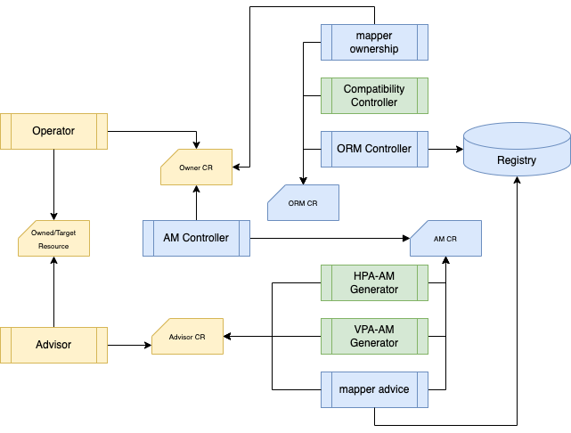

# Operator Resource Mapping with Advice Mappings 

<!-- START doctoc generated TOC please keep comment here to allow auto update -->
<!-- DON'T EDIT THIS SECTION, INSTEAD RE-RUN doctoc TO UPDATE -->
**Table of Contents**  *generated with [DocToc](https://github.com/thlorenz/doctoc)*

- [Architecture](#architecture)
- [Quick Try](#quick-try)
  - [Prepare Redis Cluster](#prepare-redis-cluster)
  - [Horizontal Scaling](#horizontal-scaling)
  - [Declare relationship between operator and owned resource](#declare-relationship-between-operator-and-owned-resource)
  - [Horizontal Pod AutoScaler](#horizontal-pod-autoscaler)
  - [Coordinate the changes](#coordinate-the-changes)
  - [Final Result](#final-result)
- [Next Step](#next-step)

<!-- END doctoc generated TOC please keep comment here to allow auto update -->


This document describes how to use this project in Redis Operator with Auto Scalers. We need vpa and hpa generator controllers in utils folder.

## Architecture

In this phase we introduce AdviceMapping to generalize the recommendations from various Advisors and to automate the execution of recommendation. 




## Quick Try

In order to broader the adoption of ORM and AM, we also added utility controllers to automatically generate AM resource from community tools like VPA, HPA. Here we use HPA as an example.

Start your ORM controller locally to try the features in this phase.

### Prepare Redis Cluster

In order to show relationship between operator and the resource it manages we use Redis operator from [OT_CONTAINER-KIT](https://github.com/OT-CONTAINER-KIT/redis-operator#quickstart). We created redis cluster.

```shell
helm list -A
```

```shell
NAME            NAMESPACE       REVISION        UPDATED                                 STATUS          CHART                      APP VERSION
redis-cluster   ot-operators    1               2023-03-13 12:52:52.716665 -0400 EDT    deployed        redis-cluster-0.14.3       0.14.0     
redis-operator  ot-operators    1               2023-03-13 12:31:40.264923 -0400 EDT    deployed        redis-operator-0.14.3      0.14.0     
```

```shell
kubectl get rediscluster -A
```

```shell
NAMESPACE      NAME            CLUSTERSIZE   LEADERREPLICAS   FOLLOWERREPLICAS   AGE
ot-operators   redis-cluster   3             3                3                  4h7m
```

```shell
kubectl get sts -n ot-operators 
```

```shell
NAME                     READY   AGE
redis-cluster-follower   3/3     4h7m
redis-cluster-leader     3/3     4h8m
```

### Horizontal Scaling

The replicas of redis-cluster-leader is controlled by RedisCluster resource from Redis Operator

```shell
kubectl get rediscluster -n ot-operators   redis-cluster -o yaml
```

```yaml
apiVersion: redis.redis.opstreelabs.in/v1beta1
kind: RedisCluster
metadata:
  annotations:
    meta.helm.sh/release-name: redis-cluster
    meta.helm.sh/release-namespace: ot-operators
    test: value
  name: redis-cluster
  namespace: ot-operators
...
spec:
  redisLeader:
    replicas: 3
...
```

### Declare relationship between operator and owned resource

We need the operatorresourcemapping resource defined in orm.yaml to declare the relationship

```shell
kubectl apply -f ./docs/p2/orm.yaml
```

```yaml
apiVersion: devops.turbonomic.io/v1alpha1
kind: OperatorResourceMapping
metadata:
  name: rediscluster
  namespace: ot-operators
...
spec:
  mappings:
    patterns:
    - owned:
        apiVersion: apps/v1
        kind: StatefulSet
        name: redis-cluster-leader
        path: .spec.replicas
      ownerPath: .spec.redisLeader.replicas
  owner:
    apiVersion: redis.redis.opstreelabs.in/v1beta1
    kind: RedisCluster
    name: redis-cluster
```

This ORM let our controllers coordinate changes to the operand. if our controller is running, you'll find the value in status.

### Horizontal Pod AutoScaler

Horizontal Pod AutoScaler is part of kubernetes, we just need to create the HPA resource for it

```shell
kubectl apply -f ./docs/p2/redis-hpa.yaml -o yaml
```

```yaml
apiVersion: autoscaling/v1
kind: HorizontalPodAutoscaler
metadata:
  name: redis-cluster-leader
  namespace: ot-operators
...
spec:
  maxReplicas: 5
  minReplicas: 1
  scaleTargetRef:
    apiVersion: apps/v1
    kind: StatefulSet
    name: redis-cluster-leader
  targetCPUUtilizationPercentage: 80
status:
  currentReplicas: 0
  desiredReplicas: 0
```

Without our project, kubernetes attempts to modify the `spec.replicas` in StatefulSet with value from its `status.desiredReplicas`. This change will eventually be reverted by operator controller back to the value defined in RedisCluster resource.

### Coordinate the changes

Mke sure our controller is started, you'll find an AdviceMapping resource is generated automatically with the right operand as the owner in the mappings. 

<em>In this quick example, we create AdviceMapping for all values in desiredReplicas. The controller could be upgraded to generate AdviceMapping for non-zero desiredReplicas. </em>

```shell
kubectl get am -n ot-operators -o yaml
```

```
apiVersion: v1
items:
- apiVersion: devops.turbonomic.io/v1alpha1
  kind: AdviceMapping
  metadata:
    name: redis-cluster-leader
    namespace: ot-operators
...
  spec:
    mappings:
    - advisor:
        apiVersion: autoscaling/v2
        kind: HorizontalPodAutoscaler
        name: redis-cluster-leader
        namespace: ot-operators
        path: .status.desiredReplicas
      target:
        apiVersion: apps/v1
        kind: StatefulSet
        name: redis-cluster-leader
        namespace: ot-operators
        path: .spec.replicas
  status:
    advices:
    - adviceValue:
        desiredReplicas: 0
      owner:
        apiVersion: redis.redis.opstreelabs.in/v1beta1
        kind: RedisCluster
        name: redis-cluster
        namespace: ot-operators
        path: .spec.redisLeader.replicas
      target:
        apiVersion: apps/v1
        kind: StatefulSet
        name: redis-cluster-leader
        namespace: ot-operators
        path: .spec.replicas
```

### Final Result

Now you'll find the RedisCluster is updated by our controller. Therefore `spec.replicas` in StatefulSet is adjusted by operator accordingly.

```shell
kubectl get rediscluster -n ot-operators   redis-cluster -o yaml
```

```yaml
apiVersion: redis.redis.opstreelabs.in/v1beta1
kind: RedisCluster
metadata:
  annotations:
    meta.helm.sh/release-name: redis-cluster
    meta.helm.sh/release-namespace: ot-operators
    test: value
  name: redis-cluster
  namespace: ot-operators
...
spec:
  redisLeader:
    replicas: 3
...
```

```shell
kubectl get sts -A     
NAMESPACE      NAME                     READY   AGE
ot-operators   redis-cluster-follower   3/3     4h27m
ot-operators   redis-cluster-leader     0/0     4h27m
```

## Next Step

Now you know how to use OperatorResourceMapping and AdviceMapping to coordinate changes to right resources, go ahead create your own mappings. 